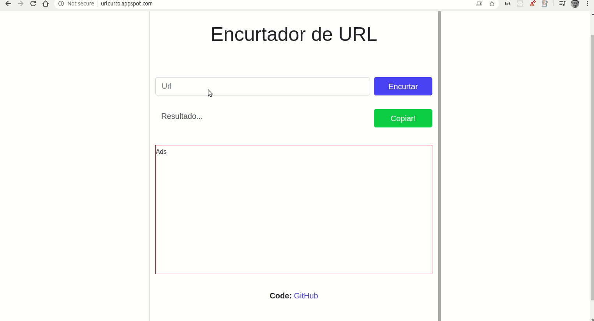

# Encurtador de URLs

Esse projeto consiste em um encurtador de links genérico desenvolvido para WEB, baseado <a href="https://www.youtube.com/watch?v=SLpUKAGnm-g">neste vídeo</a> do canal Web Dev Simplified. Nesse projeto foi possível estudar a arquitetura **MVC** e a sintaxe do **EJS** para criar templates de maneira simples que podem ser enviados para o browser do usuário.

O objetivo ao desenvolver este projeto foi apenas estudar alguns conceitos ligados ao *back-end* com Node.js. Busquei aplicar boas práticas e separar ao máximo possível os conceitos.

Ainda estou implementando os testes automatizados e integrando com Typescript o código, seguindo o tutorial mostrado na referência [1].

<h1 align="center">
  
</h1>

Para acessar o site basta clicar no seguinte link: [Encurtador de links](http://urlcurto.appspot.com/).

---

### Possíveis melhorias:

- Melhorar o layout;
  - Adicionar a opção de Night Mode (referência: <a href="https://willianjusten.com.br/adicionando-night-mode-no-seu-site/">link</a>);
  - Adicionar um menu lateral com dados das minhas redes sociais (referência: <a href="https://willianjusten.com.br/menu-sticky-e-smooth-scroll-com-css-puro/">link</a>);
- Completar automaticamente o link com https://www;
- Conseguir um certificado para o link do site ficar https (ssl, openssl, lets encrypt);
- Entender porque os ads do google não são mostrados.
- Subir o projeto no Heroku.

### Funcionamento:

No site do projeto, o usuário entra com um link em um campo input e quando faz o submit clicando no botão "encurtar", o sistema gera um id relacionado a esse link, salvando o id e o link original no banco de dados (MongoDB Atlas). Para recuperar o link completo, foi criada uma rota no Express que recebe um parâmetro da requisição e faz a busca no banco de dados por um id igual ao informado na Url dessa requisição. Caso encontre, o usuário é redirecionado para o site correspondente armazenado no banco de dados com aquele id.

Nesse projeto foi utilizado o padrão <strong>MVC</strong> (<i>Model, View, Controller</i>) para arquitetura do código.

O banco de dados escolhido foi o <strong>MongoDB</strong> devido à familiaridade e facilidade de implementação. O backend foi desenvolvido no <strong>Node.js</strong> com <strong>Express</strong>, e a parte do layout, foi escolhido utilizar o <strong>EJS</strong> (<i>Effective JavaScript templating</i>).

### Como executar:

Para executar o projeto basta ter o <strong>node</strong> instalado, fazer um clone desse repositório para uma pasta qualquer, ir até a pasta que foi criada com os arquivos do projeto e executar um <i>npm install</i> para instalar as dependências (<i>node_modules</i>).

```bash
  $ git clone https://github.com/64J0/UrlEncurtador
  $ cd urlEncurtador/
  $ npm install
```

Dentro dos arquivos do projeto também é necessário realizar algumas alterações. São elas:
1. alterar os valores da <i>connection string</i> no arquivo <i>.env</i>.
2. mudar a <i>baseUrl</i> em <i>controllers/info.json</i> para <i>http://localhost:5000/</i>.

Feito isso, devemos navegar até a pasta do projeto no prompt de comando e executar:

```bash
  $ npm run dev
```

Atualmente o layout do arquivo está desse jeito:


---
## Referências:

[1] - [How to Setup a TypeScript + Node.js Project](https://khalilstemmler.com/blogs/typescript/node-starter-project/)

Vinícius Gajo Marques Oliveira, 2020.
